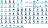
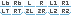

# Quick Hint
A simple Godot 4 addon/script for creating in-game input hints. It uses the following buttons from [brastin3](https://brastin3.itch.io):  
  

  
It does not distinguish betweens platforms, and just chooses nintendo buttons if the input type is a controller.

# Usage
To get an input hint, simply call `QuickHint.load_input_image(event)` where event is whatever `InputEvent` you need an image for. QuickHint can only take the following input events:

- `InputEventJoypadButton`
- `InputEventJoypadMotion`
- `InputEventMouseButton`
- `InputEventKey`

The function will return a `Texture` you can assign to a sprite.

# Installation
Simply clone the repository, and copy everything in the `addons` folder into your godot project, or search "QuickHint" in the Godot asset lib.

# Contributing
If you wanna add something, make a pr. I'll probably accept it.